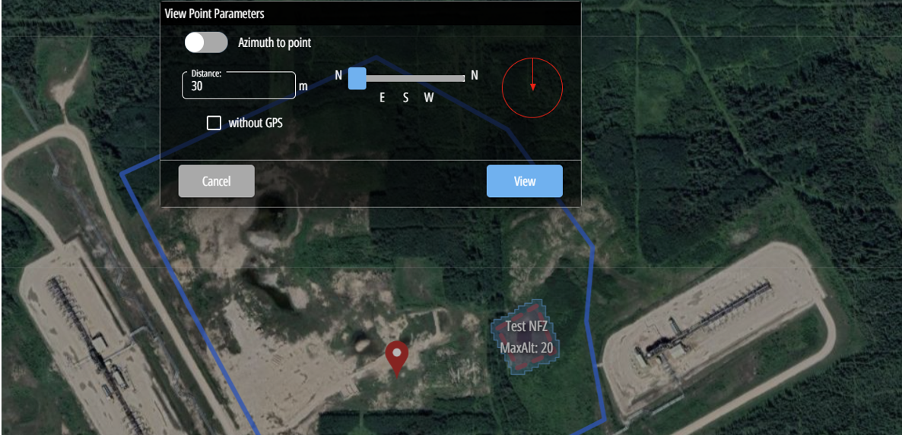
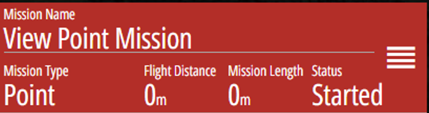
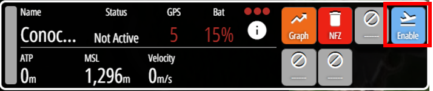
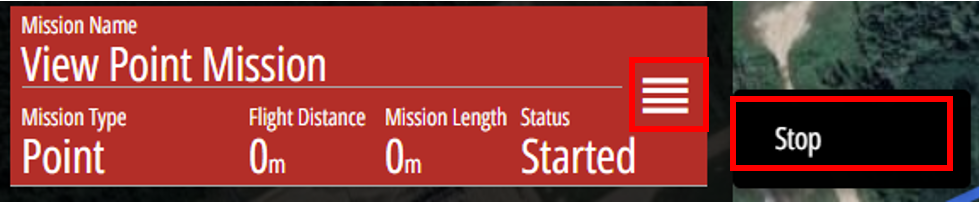
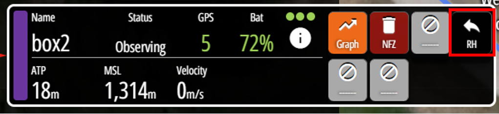
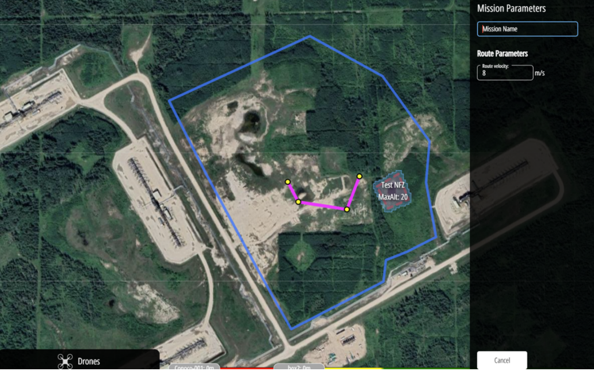
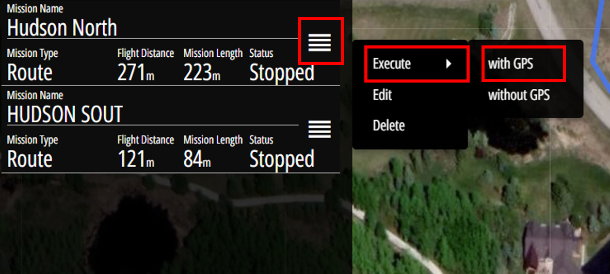
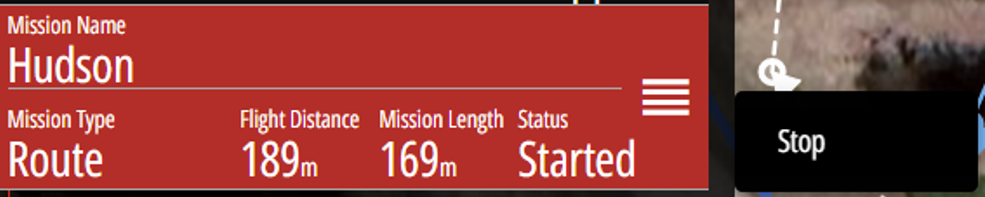

# Making a New Mission 

## Viewpoint Mission 

* Best for testing 
* Will fly to the set point and observe
* Must click return home to finish mission. 

### Setting up a Viewpoint Mission

Add mission→ Viewpoint mission→ Select point you would like to view→ Select distance
and direction you would like to view point from 

{ align=center }
 
Note: Use azimuth to point if you want the drone to go directly to that specific point

When Mission is pictured as red it means this mission is ready to fly it will be pictured as red 

{ align=center }

You can then click on the blue enable button of the drone you wish to fly

{ align=center }

To delete or stop a viewpoint mission select the 4-white line beside the mission, followed by the stop button 
Select mission settings icon → stop 

{ align=center }

At the end of the viewpoint mission the drone will stay stationary to allow for time for observing. In this case the user must prompt a return home procedure to return to the box, this will be seen beside the drone on mission.

{ align=center }

## Route Missions 

* Set Mutiple points to create the route of the mission 
* Will only stop to observe the final point 
* Must click return home to finish the mission 

### Setting up Route Mission 

Add Mission →Route →Place dots representing waypoints → Enter → complete mission parameters →save

{ align=center }

At this time your mission will be displayed on the side but will not be started. To start the mission: 
Mission title → Mission Settings Icon  → execute  → with GPS 

{ align=center }

*Note: This is also where to go to delete and edit missions as seen above

This will then start the mission as seen below which can then be stopped and requires a return home in the same fashion as viewpoint missions. 

{ align=center }

## Security Missions 
* Preprogrammed mission 
* Done on back end and will be set up following site evaluation according to client needs
* Will outline camera angles as well as goals at each point

## Target Tracking Missions 
* Used for following a given target
* Ideal for survalience 

## Area Scan Missions 
* Not Currently set up
* Will be used for surveying missions for an outlined area
